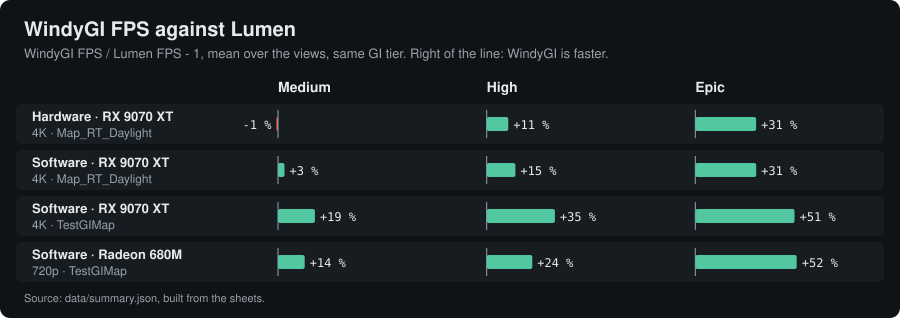
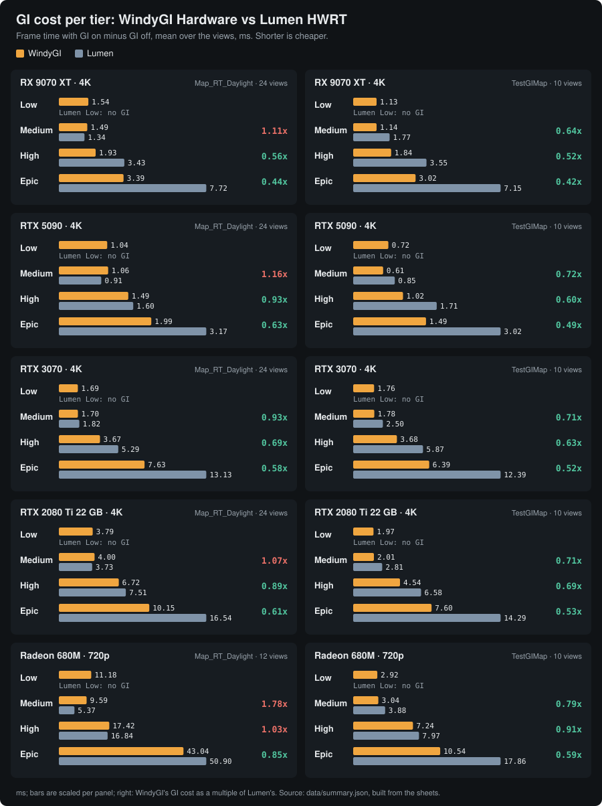
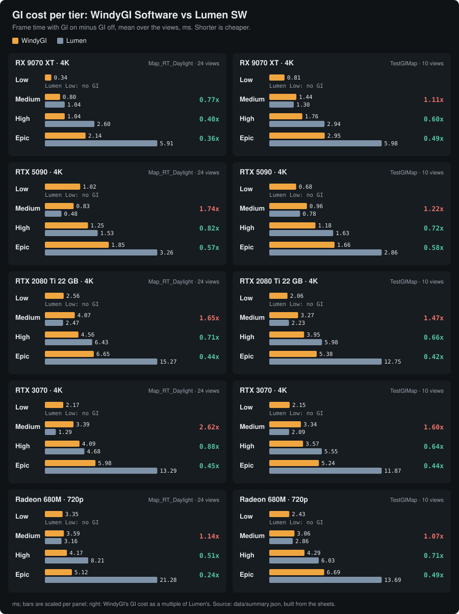

# WindyGI

Real-time global illumination for **Unreal Engine 4.27**, compared with **Lumen** from UE 5.8 and the **UE 5.8 path tracer** on the same views with matched settings.

**Live sheets: <https://windystrife.github.io/windyGI/>**

| | Sheet | Against | Maps | GPUs |
|---|---|---|---|---|
| ⚡ | **[WindyGI Hardware](https://windystrife.github.io/windyGI/hw/)** | Lumen with hardware ray tracing | Map_RT_Daylight (24 views), TestGIMap (10 views) | RX 9070 XT, RTX 5090, RTX 3070, RTX 2080 Ti 22 GB at 4K · Radeon 680M at 720p |
| 🖥️ | **[WindyGI Software](https://windystrife.github.io/windyGI/sw/)** | Lumen with software ray tracing | Map_RT_Daylight (24 views), TestGIMap (10 views) | RX 9070 XT, RTX 5090, RTX 3070, RTX 2080 Ti 22 GB at 4K · Radeon 680M at 720p |

Each sheet has a drag-to-compare viewer (any two sources, any tier, as played or at a fixed exposure next to the path tracer), the frame time of every view and the GI cost (GI on minus GI off).

<table>
<tr>
<td align="center"><br><sub>UE 5.8 path tracer, 2048 spp</sub></td>
<td align="center"><br><sub>WindyGI Hardware, High</sub></td>
<td align="center"><br><sub>Lumen HWRT, High</sub></td>
</tr>
</table>
<sub>Map_RT_Daylight, view v14, the same fixed exposure for all three.</sub>

## At a glance







## WindyGI Hardware against Lumen HWRT

Mean over the views (Map_RT_Daylight 24, on the Radeon 680M 12; TestGIMap 10), one measured process per engine and tier (some RTX 3070 Map_RT_Daylight arms have two; the sheet lists them per GPU).

| GPU | Map | GI tier | WindyGI FPS | Lumen FPS | GI cost, WindyGI | GI cost, Lumen | WindyGI faster at |
|---|---|---|--:|--:|--:|--:|--:|
| RX 9070 XT, 4K | Map_RT_Daylight | Medium | 88.3 | 90.7 | 1.49 ms | 1.34 ms | 3 / 24 |
|  |  | High | **85.0** | 76.2 | **1.93 ms** | 3.43 ms | **24 / 24** |
|  |  | Epic | **75.6** | 57.5 | **3.39 ms** | 7.72 ms | **24 / 24** |
|  | TestGIMap | Medium | **131.5** | 106.0 | **1.14 ms** | 1.77 ms | **10 / 10** |
|  |  | High | **120.3** | 89.1 | **1.84 ms** | 3.55 ms | **10 / 10** |
|  |  | Epic | **105.3** | 67.5 | **3.02 ms** | 7.15 ms | **10 / 10** |
| RTX 5090, 4K | Map_RT_Daylight | Medium | **171.7** | 158.0 | 1.06 ms | 0.91 ms | **24 / 24** |
|  |  | High | **159.8** | 142.5 | **1.49 ms** | 1.60 ms | **24 / 24** |
|  |  | Epic | **148.1** | 116.5 | **1.99 ms** | 3.17 ms | **24 / 24** |
|  | TestGIMap | Medium | **216.1** | 188.9 | **0.61 ms** | 0.85 ms | **10 / 10** |
|  |  | High | **198.7** | 162.5 | **1.02 ms** | 1.71 ms | **10 / 10** |
|  |  | Epic | **181.6** | 134.0 | **1.49 ms** | 3.02 ms | **10 / 10** |
| RTX 3070, 4K | Map_RT_Daylight | Medium | **64.6** | 58.4 | **1.70 ms** | 1.82 ms | **24 / 24** |
|  |  | High | **57.3** | 48.5 | **3.67 ms** | 5.29 ms | **24 / 24** |
|  |  | Epic | **46.7** | 35.2 | **7.63 ms** | 13.13 ms | **24 / 24** |
|  | TestGIMap | Medium | **86.5** | 72.6 | **1.78 ms** | 2.50 ms | **10 / 10** |
|  |  | High | **74.3** | 58.3 | **3.68 ms** | 5.87 ms | **10 / 10** |
|  |  | Epic | **61.8** | 42.2 | **6.39 ms** | 12.39 ms | **10 / 10** |
| RTX 2080 Ti 22 GB, 4K | Map_RT_Daylight | Medium | **55.9** | 52.5 | 4.00 ms | 3.73 ms | 23 / 24 |
|  |  | High | **48.5** | 43.8 | **6.72 ms** | 7.51 ms | **24 / 24** |
|  |  | Epic | **41.6** | 31.4 | **10.15 ms** | 16.54 ms | **24 / 24** |
|  | TestGIMap | Medium | **74.7** | 61.7 | **2.01 ms** | 2.81 ms | **10 / 10** |
|  |  | High | **62.8** | 50.1 | **4.54 ms** | 6.58 ms | **10 / 10** |
|  |  | Epic | **52.7** | 36.1 | **7.60 ms** | 14.29 ms | **10 / 10** |
| Radeon 680M, 720p | Map_RT_Daylight | Medium | 15.8 | 16.1 | 9.59 ms | 5.37 ms | 8 / 12 |
|  |  | High | **14.0** | 13.6 | 17.42 ms | 16.84 ms | 9 / 12 |
|  |  | Epic | **10.3** | 9.3 | **43.04 ms** | 50.90 ms | 9 / 12 |
|  | TestGIMap | Medium | **70.7** | 61.9 | **3.04 ms** | 3.88 ms | **10 / 10** |
|  |  | High | **54.5** | 49.4 | **7.24 ms** | 7.97 ms | 9 / 10 |
|  |  | Epic | **46.2** | 33.2 | **10.54 ms** | 17.86 ms | **10 / 10** |

Lumen Low has no GI at all, so the Low rows (on the sheet) are the price of having GI. Build: UE 4.27 branch `4.27-Soliz` at `0cee8223` (package RT_88TG) on Map_RT_Daylight; on TestGIMap the same code cooked with the SW project's TestGIMap (RT_88TGm), and on the Radeon 680M RT_92 (the ArrivalBoost kick on a tier change, in `4.27-Soliz` since `1795aeff`).

## WindyGI Software against Lumen SW

| GPU | Map | GI tier | WindyGI FPS | Lumen FPS | GI cost, WindyGI | GI cost, Lumen | WindyGI faster at |
|---|---|---|--:|--:|--:|--:|--:|
| RX 9070 XT, 4K | Map_RT_Daylight | Medium | **94.5** | 91.9 | **0.80 ms** | 1.04 ms | 23 / 24 |
|  |  | High | **92.3** | 80.4 | **1.04 ms** | 2.60 ms | **24 / 24** |
|  |  | Epic | **83.9** | 63.5 | **2.14 ms** | 5.91 ms | **24 / 24** |
|  | TestGIMap | Medium | **131.4** | 110.7 | 1.44 ms | 1.30 ms | **10 / 10** |
|  |  | High | **126.2** | 93.7 | **1.76 ms** | 2.94 ms | **10 / 10** |
|  |  | Epic | **109.7** | 72.9 | **2.95 ms** | 5.98 ms | **10 / 10** |
| RTX 5090, 4K | Map_RT_Daylight | Medium | **182.2** | 157.6 | 0.83 ms | 0.48 ms | **24 / 24** |
|  |  | High | **169.4** | 135.2 | **1.25 ms** | 1.53 ms | **24 / 24** |
|  |  | Epic | **153.7** | 109.6 | **1.85 ms** | 3.26 ms | **24 / 24** |
|  | TestGIMap | Medium | **207.1** | 189.1 | 0.96 ms | 0.78 ms | 8 / 10 |
|  |  | High | **198.3** | 163.1 | **1.18 ms** | 1.63 ms | **10 / 10** |
|  |  | Epic | **180.8** | 135.7 | **1.66 ms** | 2.86 ms | **10 / 10** |
| RTX 3070, 4K | Map_RT_Daylight | Medium | 58.2 | 58.6 | 3.39 ms | 1.29 ms | 7 / 24 |
|  |  | High | **55.9** | 48.9 | **4.09 ms** | 4.68 ms | **24 / 24** |
|  |  | Epic | **50.5** | 34.4 | **5.98 ms** | 13.29 ms | **24 / 24** |
|  | TestGIMap | Medium | **75.6** | 73.9 | 3.34 ms | 2.09 ms | 8 / 10 |
|  |  | High | **74.4** | 58.9 | **3.57 ms** | 5.55 ms | **10 / 10** |
|  |  | Epic | **66.1** | 42.9 | **5.24 ms** | 11.87 ms | **10 / 10** |
| RTX 2080 Ti 22 GB, 4K | Map_RT_Daylight | Medium | 56.0 | 56.2 | 4.07 ms | 2.47 ms | 13 / 24 |
|  |  | High | **54.5** | 46.0 | **4.56 ms** | 6.43 ms | **24 / 24** |
|  |  | Epic | **48.9** | 32.7 | **6.65 ms** | 15.27 ms | **24 / 24** |
|  | TestGIMap | Medium | **68.3** | 64.2 | 3.27 ms | 2.23 ms | **10 / 10** |
|  |  | High | **65.2** | 51.7 | **3.95 ms** | 5.98 ms | **10 / 10** |
|  |  | Epic | **59.7** | 38.3 | **5.38 ms** | 12.75 ms | **10 / 10** |
| Radeon 680M, 720p | Map_RT_Daylight | Medium | **20.0** | 18.3 | 3.59 ms | 3.16 ms | **24 / 24** |
|  |  | High | **19.8** | 16.7 | **4.17 ms** | 8.21 ms | **24 / 24** |
|  |  | Epic | **19.4** | 13.7 | **5.12 ms** | 21.28 ms | **24 / 24** |
|  | TestGIMap | Medium | **73.9** | 65.6 | 3.06 ms | 2.86 ms | **10 / 10** |
|  |  | High | **67.7** | 54.3 | **4.29 ms** | 6.03 ms | **10 / 10** |
|  |  | Epic | **58.3** | 38.3 | **6.69 ms** | 13.69 ms | **10 / 10** |

The Low rows (no GI in Lumen Low) are on the sheet. Build: `windygi-software-427` at `abc7e847` (M18b); on the RTX 5090 M18c, M18b with the trace shader split so its pipeline state is created on Blackwell drivers.

## Test machines

| GPU | CPU | RAM | Resolution |
|---|---|---|---|
| Radeon RX 9070 XT 16 GB | Ryzen 9 7940HX (16C / 32T) | 64 GB DDR5-4800 | 3840x2160 fullscreen |
| GeForce RTX 5090 32 GB | Core i9-13900KF (24C / 32T) | 96 GB DDR5-4000 | 3840x2160 fullscreen |
| GeForce RTX 3070 8 GB | Xeon E5-2696 v3 (18C / 36T) | 128 GB DDR3-1600 | 3840x2160 offscreen |
| GeForce RTX 2080 Ti 22 GB | Xeon E5-2696 v4 (22C / 44T) | 128 GB DDR3-1866 | 3840x2160 offscreen |
| Radeon 680M (AOKZOE A1 Pro, on AC) | Ryzen 7 6800U (8C / 16T) | 16 GB LPDDR5-6400, shared with the iGPU | 1280x720 fullscreen |

All on Windows 11, the game at Normal priority on an otherwise idle machine. Each sheet shows the machine of the GPU you pick.

## Which GI is WindyGI closest to?

WindyGI started as a port of kajiya to UE 4.27 and was reshaped after the real-time GI that shipped in games
([landing page, with a table of the systems](https://windystrife.github.io/windyGI/#kin)):

- **WindyGI Hardware is closest to id Tech 8 (DOOM: The Dark Ages).** Cache first: a world radiance cache in a spatial hash and
  cascaded irradiance probe volumes with a depth test against leaks, ray tracing spent on keeping them current, async compute.
  Unlike id Tech 8 it has no per-pixel ray into the caches and no separate visibility pass. At Low and Medium it is the probe volume
  alone, which is DDGI (RTXGI) read the way Lumen reads its irradiance field.
- **WindyGI Software is closest to Lumen software at Medium.** Lumen's surface cache brought to UE 4.27, distance-field rays and
  the irradiance field as the final gather, kept at every tier.

## WindyGI and Lumen: what is alike, what differs

The full comparison is on the [landing page](https://windystrife.github.io/windyGI/#vs-lumen). In short:

- **Alike.** Fully dynamic diffuse GI with multiple bounces, sky light and emissive, tiers from `sg.GlobalIlluminationQuality`,
  Lumen's depth-buffer horizon search for short-range AO, async compute. Reflections are screen-space on both sides of the sheets.
- **WindyGI Hardware vs Lumen HWRT.** Both use hardware ray tracing, but WindyGI has no surface cache: a hit runs the material's hit
  shader plus one shadowed light sample and the bounce from WindyGI's caches, a cascaded probe volume at every tier (4 x 32³ probes, 1 m
  cells nearest) and a world radiance cache in a spatial hash at High and Epic. There are no per-pixel GI rays (each pixel reads the
  caches, where Lumen traces screen probes), and WindyGI Low keeps GI where Lumen Low has none.
- **WindyGI Software vs Lumen SW.** Lumen's surface cache (mesh cards, relighting, radiosity) is ported to UE 4.27, but the rays trace
  only the global distance field (no mesh SDFs), and the final gather is an irradiance field at every tier (Lumen uses one at Medium,
  screen probes and a radiance cache at High and Epic), helped by caches of its own (on-screen surface points, 25 cm voxels). It runs on
  any Shader Model 5 GPU, down to the Radeon 680M.

## How it was measured

- **Same scene, same views.** Both engines visit the same camera poses in the same order; UE 5.8 takes the FOV converted from UE 4.27's, so the framing matches pixel for pixel.
- **Matched settings.** TAA at 100 % screen percentage, no upscaler or frame generation, fog and motion blur off, UE 5.8 shadows set to UE 4.27's values, no SSAO, Lumen reflections off and screen-space reflections at the same quality in both.
- **Frame time.** Mean of a 400-frame CSV capture per view after settling (240 frames on the Radeon 680M), in packaged Development builds. FPS is 1000 divided by the mean frame time.
- **GI cost.** The frame time with GI on minus the same package's frame time with GI off, process by process in the same session.
- **The light level is judged against the path tracer**, not against Lumen: the path tracer is shown for the tent views, where its scene is complete.

## Adding a GPU

1. Run the benchmark kit on the new GPU and rebuild the sheet that covers it: its `index.html` embeds the numbers. The kit records the
   test machine (CPU, cores and threads, RAM type and speed, GPU, driver, OS) next to its results, and the sheet shows it. Both sheets
   hold several GPUs and both maps behind their pickers.
2. `python tools/build_summary.py` collects every sheet (`hw/`, `sw/`), GPU and map into `data/summary.json`, test machine included.
3. `python tools/make_charts.py` redraws `charts/*.svg`; each new GPU or map becomes a new panel.
4. Add its rows to the tables above and commit.

Both scripts are plain Python 3 with no dependencies.

## Layout

```
index.html   landing page
hw/          WindyGI Hardware sheet: index.html (data embedded) + img/*.webp
sw/          WindyGI Software sheet: index.html (data embedded) + img/*.webp
data/        summary.json: the headline numbers of every sheet, GPU, map and tier
charts/      the README infographics (SVG, drawn from data/summary.json)
tools/       build_summary.py, make_charts.py
```

The pages are static and have no build step: open any `index.html` locally or serve the folder.
